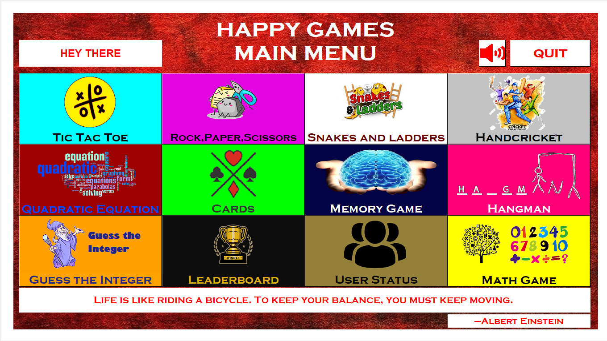
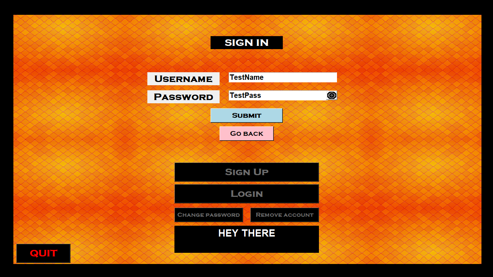
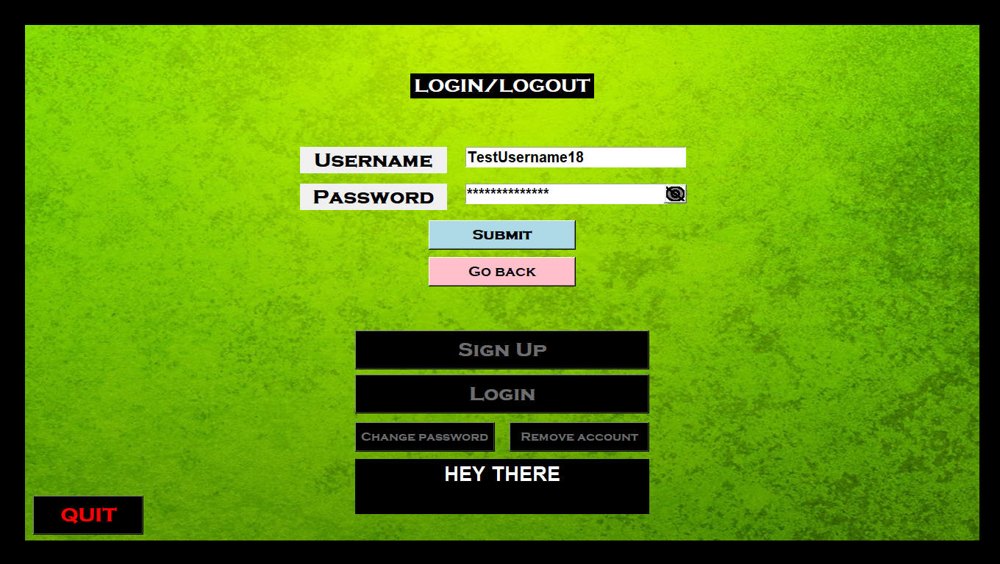
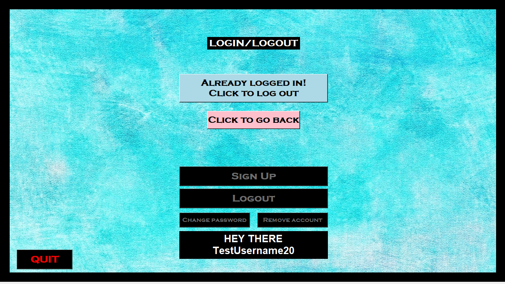
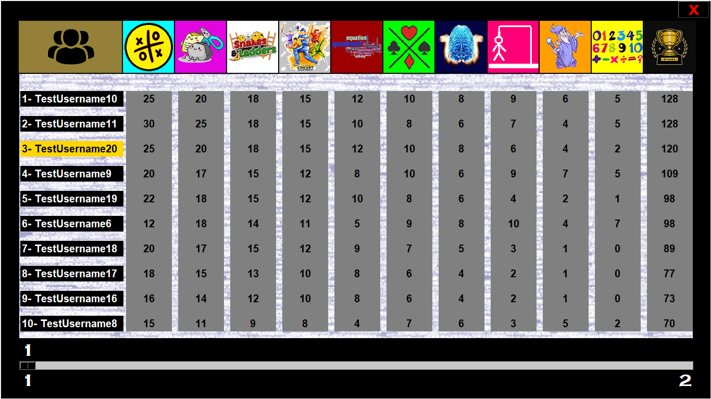
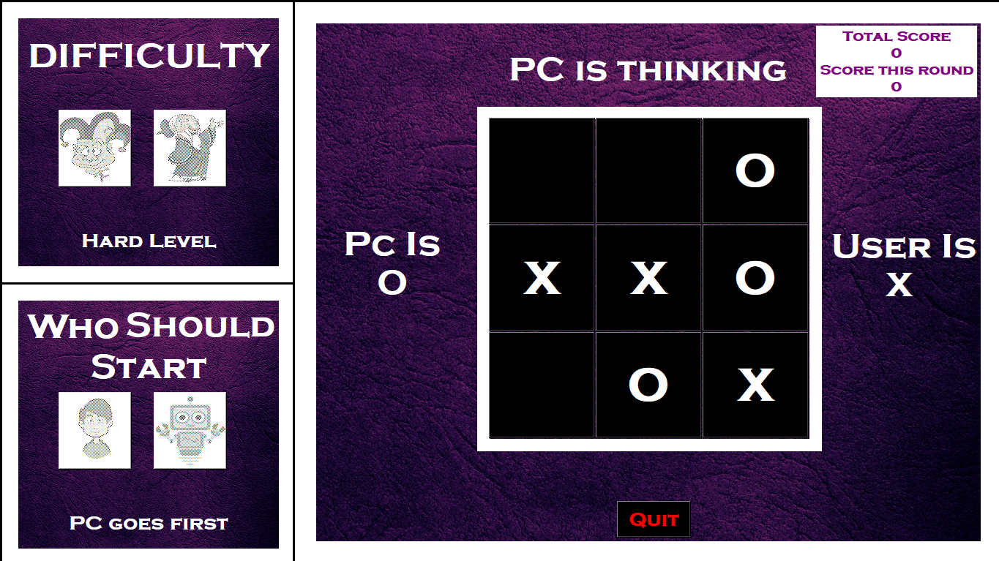
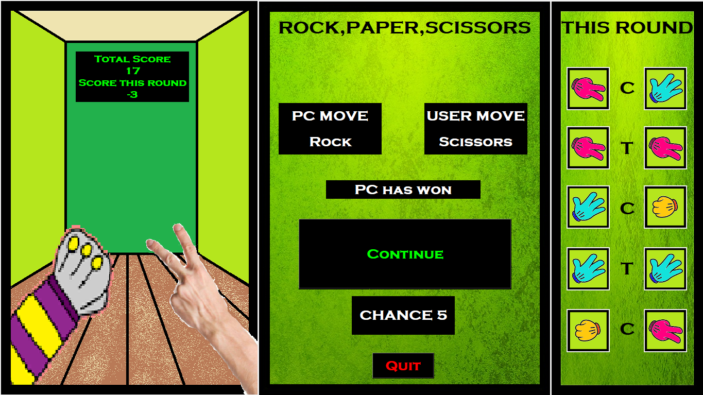
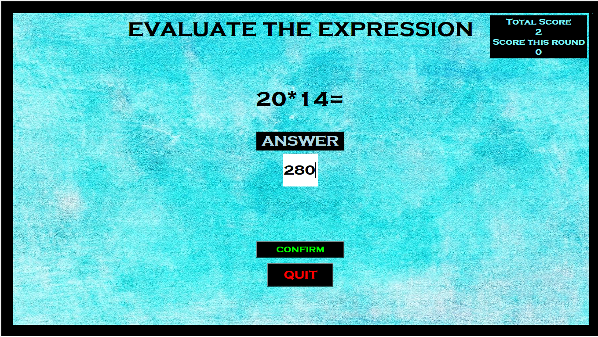

# HappyGames 🎮

An all-in-one Python Tkinter game hub featuring multiple mini-games, a user account system, leaderboards, and MySQL integration.

## Features
- **Mini-games included:**
  - Memory Game
  - Cards (Crazy 8)
  - Tic-Tac-Toe (Easy/Hard)
  - Hand Cricket
  - Rock, Paper, Scissors
  - Snakes and Ladders
  - Hangman
  - Integer Guessing Game
  - Basic Math Game
  - Quadratic Equation Solver
- **User accounts** — log in or play as guest.
- **Leaderboards** — track per-game and total scores.
- **Motivational quotes** on the home screen (fetched from MySQL).
- **Sound effects** and themed graphics.
- Fully GUI-based using Tkinter.

## Tech Stack
- **Python 3**
- **Tkinter** – GUI interface
- **MySQL** – Data storage
- **mysql-connector-python** – MySQL connection
- **Pygame** – Sound effects
- **Random** – Gameplay randomness

## Project Structure
```
HappyGames/
│
├── main.py               # Main entry point
├── mysqlData.py          # MySQL initialization script
├── supportfile/
│   ├── Cards/
│   ├── GAME/
│   ├── Guess The Integer/
│   ├── Handcricket/
│   ├── Hangman/
│   ├── Leaderboard/
│   ├── Math Game/
│   ├── Memory/
│   ├── Quadratic Equation/
│   ├── Rock Paper Scissors/
│   ├── Snakes and Ladders/
│   ├── Tic Tac Toe/
│   ├── Userstatus/
│   ├── ButtonClick.wav
│   ├── Correct.wav
│   ├── Info.png
│   ├── Loss1.wav
│   ├── Loss2.wav
│   ├── MainMenuBG.png
│   ├── Mute.png
│   ├── Ting.wav
│   ├── Unmute.png
│   ├── Win.wav
│   └── Wrong.wav
```

## Database Setup

Database name: **`HappyGames`**

Tables:
1. **`hangman`** – Words for the Hangman game (10 categories × 20 words)
2. **`quote`** – Quotes & authors for main menu
3. **`userpwd`** – Username, password, login status (PK: `username`)
4. **`leaderboard`** – Scores per game & overall score (FK: `username` → `userpwd.username`)

### Creating the database and tables

1. Start MySQL and run these queries (also found at the top of `mysqlData.py`):
```sql
CREATE DATABASE HappyGames;
USE HappyGames;

CREATE TABLE userpwd (
    username VARCHAR(30),
    password VARCHAR(30),
    status VARCHAR(1),
    PRIMARY KEY(username)
);

CREATE TABLE leaderboard (
    username VARCHAR(30),
    tictactoe INT(4),
    rockpaperscissors INT(4),
    snakesandladders INT(4),
    handcricket INT(4),
    quadraticEquation INT(4),
    cards INT(4),
    memory INT(4),
    hangman INT(4),
    guessTheInteger INT(4),
    mathGame INT(4),
    overall INT(4),
    FOREIGN KEY (username) REFERENCES userpwd(username)
);

CREATE TABLE hangman (
    countries VARCHAR(20),
    capitals VARCHAR(20),
    animals VARCHAR(20),
    mobiles VARCHAR(20),
    cars VARCHAR(20),
    fruits VARCHAR(20),
    vegetables VARCHAR(20),
    birds VARCHAR(20),
    flowers VARCHAR(20),
    proglang VARCHAR(20)
);

CREATE TABLE quote (
    saying VARCHAR(300),
    author VARCHAR(30)
);
```

2. Edit `mysqlData.py` and enter your MySQL credentials:
```python
user = 'your_mysql_username'
pwd = 'your_mysql_password'
db = 'HappyGames'
```

3. Run `mysqlData.py` to insert all words and quotes:
```bash
python mysqlData.py
```

## ⚙️ Installation & Running
1. **Install Python 3** and **MySQL**.
2. Clone the repo:
   ```bash
   git clone https://github.com/yourusername/HappyGames.git
   cd HappyGames
   ```
3. Install dependencies:
   ```bash
   pip install -r requirements.txt
   ```
4. Update MySQL credentials in `main.py`:
   ```python
   user = 'your_mysql_user'
   pwd = 'your_mysql_password'
   db = 'HappyGames'
   ```
5. Initialize the database:
   ```bash
   python mysqlData.py
   ```
6. Run the game:
   ```bash
   python main.py
   ```

## Gameplay
- Log in with username & password, or play as guest.
- Select a game from the menu.
- Win games to earn points.
- Track your rank on the leaderboard.

## Screenshots
**Home Page**



**User Status**





**Leaderboard**



**Tic Tac Toe**



**Rock Paper Scissors**



**Snakes and Ladders**


**Handcricket**


**Quadratic Equation**


**Crazy 8**


**Memory Game**


**Hangman**


**Math Game**



**Guessing Game**


